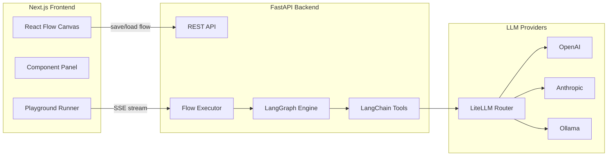

# AI 工作流编排平台技术栈规划

## 前端

- **框架**: Next.js 15 (App Router) + TypeScript
- **画布引擎**: [React Flow](https://reactflow.dev/) — 业界主流的节点连线库，内置拖拽、连线、缩放，Langflow/Flowise 同款
- **UI 组件**: shadcn/ui + Tailwind CSS
- **状态管理**: Zustand（管理节点/边的全局状态）
- **表单**: React Hook Form + Zod
- **HTTP 客户端**: fetch / SWR（流式响应用 EventSource 或 fetch streams）

## 后端

- **框架**: FastAPI (Python) — 异步优先，SSE/Stream 支持好，生态与 LangChain 无缝对接
- **运行时**: Python 3.12 + uv（包管理）
- **数据库**: PostgreSQL（工作流持久化） + Redis（会话/任务队列）
- **任务队列**: Celery + Redis（异步执行工作流）
- **WebSocket/SSE**: FastAPI 原生支持，推送执行进度

## LLM 调用层

**推荐: LangChain + LangGraph**，原因：

| 方案 | 优点 | 缺点 |
|------|------|------|
| **LangChain** | 工具链完整、Toolset/Agent 概念直接对应图中节点、生态最大 | 抽象层较重 |
| **LangGraph** | 将工作流建模为 DAG 图，与可视化编排天然对应 | 学习曲线 |
| LiteLLM | 统一多 Provider API，极轻量 | 无 Agent/工具编排能力 |
| 直接调用 SDK | 最灵活，无抽象 | 需自己实现 Tool/Agent 循环 |

**结论**: 用 **LangChain + LangGraph** 作为执行引擎，LiteLLM 做 Provider 路由层（兼容 OpenAI/Claude/Gemini/本地模型），前端节点图 → 后端转换为 LangGraph 的 StateGraph 执行。

## 工作流数据模型

```
Flow {
  id, name, nodes[], edges[]
}

Node {
  id, type, position, data: { config }
}
// type: url | calculator | agent | chat_input | chat_output | toolset | ...
```

## 架构图



## 目录结构

```
NodeList_LLM/
├── frontend/          # Next.js
│   ├── app/
│   ├── components/
│   │   ├── canvas/    # React Flow 画布
│   │   ├── nodes/     # 各类节点组件
│   │   └── panel/     # 左侧组件面板
│   └── stores/        # Zustand
├── backend/           # FastAPI
│   ├── api/
│   ├── nodes/         # 节点执行器（url, calculator, agent...）
│   ├── executor/      # Flow → LangGraph 转换 + 执行
│   └── providers/     # LiteLLM 配置
└── docker-compose.yml
```
